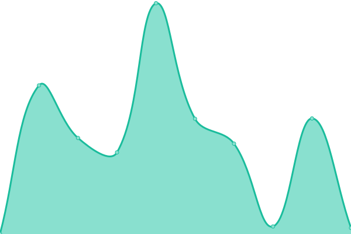

# [📈 Live Status](https://eugeneyng.github.io/upptime): <!--live status--> **🟧 Partial outage**

This repository contains the open-source uptime monitor and status page for [Eugene Ng](https://eugeneyng.github.io/upptime), powered by [Upptime](https://github.com/upptime/upptime).

With [Upptime](https://upptime.js.org), you can get your own unlimited and free uptime monitor and status page, powered entirely by a GitHub repository. We use [Issues](https://github.com/eugeneyng/upptime/issues) as incident reports, [Actions](https://github.com/eugeneyng/upptime/actions) as uptime monitors, and [Pages](https://eugeneyng.github.io/upptime) for the status page.

<!--start: status pages-->
<!-- This summary is generated by Upptime (https://github.com/upptime/upptime) -->
<!-- Do not edit this manually, your changes will be overwritten -->
<!-- prettier-ignore -->
| URL | Status | History | Response Time | Uptime |
| --- | ------ | ------- | ------------- | ------ |
|  [eugene.ng](https://eugeneyng.github.io/) | 🟩 Up | [eugene-ng.yml](https://github.com/eugeneyng/upptime/commits/HEAD/history/eugene-ng.yml) | 

 145ms
     
 | 

<a href="https://eugeneyng.github.io/upptime/history/eugene-ng">100.00%</a>
    

|  [cassie.ng](https://cassie.ng) | 🟩 Up | [cassie-ng.yml](https://github.com/eugeneyng/upptime/commits/HEAD/history/cassie-ng.yml) | 

 6913ms
     
 | 

<a href="https://eugeneyng.github.io/upptime/history/cassie-ng">76.73%</a>
    

|  [dwelli.ng](https://dwelli.ng) | 🟩 Up | [dwelli-ng.yml](https://github.com/eugeneyng/upptime/commits/HEAD/history/dwelli-ng.yml) | 

 287ms
     
 | 

<a href="https://eugeneyng.github.io/upptime/history/dwelli-ng">0.00%</a>
    

|  [lnp.app](https://lnp.app) | 🟩 Up | [lnp-app.yml](https://github.com/eugeneyng/upptime/commits/HEAD/history/lnp-app.yml) | 

 208ms
     
 | 

<a href="https://eugeneyng.github.io/upptime/history/lnp-app">100.00%</a>
    

|  [nginx](https://nginx.eugene.ng) | 🟩 Up | [nginx.yml](https://github.com/eugeneyng/upptime/commits/HEAD/history/nginx.yml) | 

 256ms
     
 | 

<a href="https://eugeneyng.github.io/upptime/history/nginx">98.20%</a>
    

|  [ihostart](http://140.233.190.163) | 🟥 Down | [ihostart.yml](https://github.com/eugeneyng/upptime/commits/HEAD/history/ihostart.yml) | 

 2669ms
     
 | 

<a href="https://eugeneyng.github.io/upptime/history/ihostart">92.62%</a>
    

<!--end: status pages-->

[**Visit our status website →**](https://eugeneyng.github.io/upptime)

## 📄 License

- Powered by: [Upptime](https://github.com/upptime/upptime)
- Code: [MIT](./LICENSE) © [Eugene Ng](https://eugeneyng.github.io/upptime)
- Data in the `./history` directory: [Open Database License](https://opendatacommons.org/licenses/odbl/1-0/)
